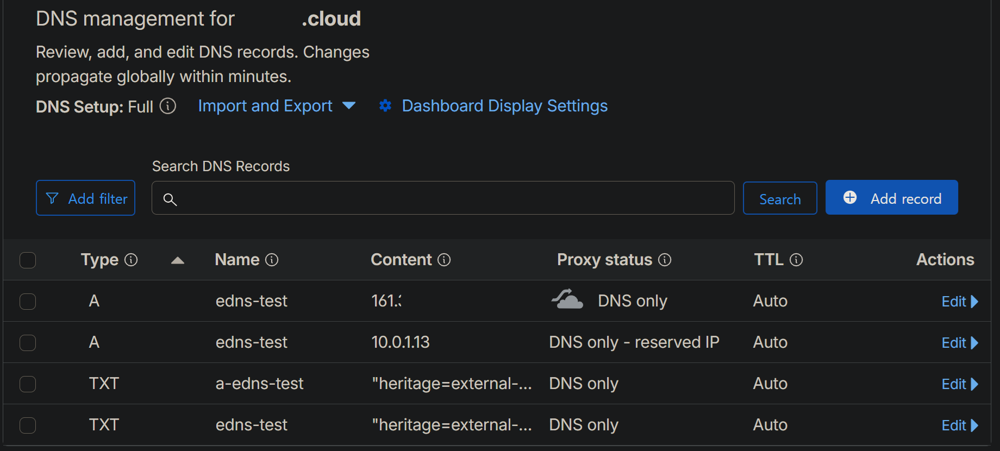

# external-dns + Cloudflare

Gateway API 리소스(`HTTPRoute`, `GRPCRoute`)의 hostname을 감지해 Cloudflare DNS 레코드를 자동 등록·갱신.

참조: https://kubernetes-sigs.github.io/external-dns/latest/docs/tutorials/cloudflare/

## 1. 전제 조건

- `external-dns` 네임스페이스 존재 (`../namespaces/namespaces.yaml`)
- Gateway API CRD 설치 완료 (`../gateway-api/`)
- Helm 3.6+
- Cloudflare 계정 + 관리 zone 존재
- Cloudflare API Token (대시보드 → My Profile → API Tokens → Create Token)
  - Permissions: `Zone : DNS : Edit` + `Zone : Zone : Read`
  - Zone Resources: `Include : Specific zone : ggang.cloud` (account-wide token 금지)
- 권장 버전: external-dns chart `~1.16.0` (app v0.16.x, Gateway API source 지원)

## 2. 설치

```bash
kubectl create secret generic cloudflare-api-token \
  -n external-dns \
  --from-literal=api-token='<your-cf-token>'

helm repo add external-dns https://kubernetes-sigs.github.io/external-dns/
helm repo update

helm install external-dns external-dns/external-dns \
  -n external-dns \
  --version "~1.16.0" \
  -f values.yaml \
  --set "domainFilters[0]=ggang.cloud" \
  --wait
```

## 3. 검증

```bash
kubectl get pods -n external-dns
kubectl logs -n external-dns -l app.kubernetes.io/name=external-dns --tail=30
```

DNS 자동 등록 확인 (Gateway/HTTPRoute가 이미 떠 있다면):

```bash
kubectl logs -n external-dns -l app.kubernetes.io/name=external-dns --tail=50 | grep -E "CREATE|UPDATE|DELETE"
```

### Smoke test (`dns-smoketest.yaml`)

기존 HTTPRoute가 없을 때 external-dns 동작을 격리 검증.

```bash
kubectl apply -f dns-smoketest.yaml
```

1~2분 대기 후 검증:

```bash
kubectl logs -n external-dns -l app.kubernetes.io/name=external-dns --tail=30 | grep -E "CREATE|already up to date"
nslookup "edns-test.ggang.cloud" 1.1.1.1
```



정리 (sync policy로 DNS 레코드 자동 삭제 확인):

```bash
kubectl delete -f dns-smoketest.yaml
kubectl logs -n external-dns -l app.kubernetes.io/name=external-dns --tail=10 | grep DELETE
```


## 4. 결정

### Cloudflare provider

도메인 등록처가 Cloudflare. external-dns가 1급 지원하는 provider 중 API 안정성·무료 zone 지원 측면에서 우위. AWS Route53은 별도 클라우드 의존, OCI DNS는 external-dns provider가 존재하나 사용자 base가 얇음.

### Source = Gateway API 한정

`gateway-httproute`, `gateway-grpcroute` 만 활성화. `ingress` 와 `service` 비채택 사유: 본 프로젝트는 Ingress를 사용하지 않으며 LoadBalancer service의 IP는 Gateway status로 흡수되어 중복.

### policy: sync

`upsert-only` 대신 `sync` 선택. HTTPRoute 삭제 시 DNS 레코드도 자동 제거되어야 GitOps declarative 일관성 유지. TXT registry가 ownership을 추적하므로 external-dns가 만들지 않은 레코드는 보호됨.

### 사설 IP 제외 — `--exclude-target-net=10.0.0.0/8`

OCI 공개 NLB는 공개 IP와 함께 VCN 서브넷의 사설 IP를 동시에 보유한다. Gateway status에 두 주소가 모두 노출되면 external-dns가 A 레코드를 **둘 다** 등록하고, 공개 클라이언트(예: GitHub webhook)가 사설 IP를 선택하면 인터넷에서 라우팅 불가로 도달이 실패한다. `extraArgs`에 `--exclude-target-net=10.0.0.0/8`을 추가해 RFC1918 대역 타깃을 전역 제외 → 공개 IP만 published. `policy: sync`이므로 기존 사설 A 레코드도 자동 정리된다. 진단: `nslookup <host>`로 공개/사설 IP 동시 등록 여부 확인.

### registry: txt + txtOwnerId

`registry: txt`로 ownership을 TXT 레코드에 기록. `txtOwnerId: oci-oke`는 단일 클러스터 식별자. 추후 멀티 클러스터 도입 시 충돌 방지를 위해 클러스터마다 고유 ID 부여.

### Cloudflare proxied = false (default)

기본값이 DNS-only(proxied=false)이므로 별도 플래그 미설정. 본 환경은 OCI NLB → Istio Gateway envoy가 TLS·L7 단독 책임. Cloudflare 프록시 레이어를 추가하면 (1) TLS 재암호화 발생, (2) cert-manager DNS-01 외 HTTP-01 사용 시 Cloudflare 캐시 변수 추가. 추후 proxied 켜려면 `extraArgs: [--cloudflare-proxied]` (toggle flag, 값 없음).

### 도메인은 `--set`으로 주입

values.yaml에 도메인을 박지 않고 설치 시 `--set domainFilters[0]=...`으로 주입. 환경 분리(staging/prod) 또는 도메인 교체 시 values.yaml을 건드리지 않고 처리.

### Secret 관리 — k8s Secret 직접, Vault 이관 예정

본 단계는 `kubectl create secret`으로 직접 생성. 추후 OpenBao(Vault) 도입 시 Vault Agent Injector로 token rotation 자동화 + 정적 Secret 제거.

## 5. 주의 사항

### Token 회전

Cloudflare 대시보드에서 token rotate 시:

```bash
kubectl delete secret cloudflare-api-token -n external-dns
kubectl create secret generic cloudflare-api-token -n external-dns --from-literal=api-token='<new-token>'
kubectl rollout restart deployment/external-dns -n external-dns
```

### Zone 추가 시

새 도메인 zone을 관리 대상에 추가하려면:

1. Cloudflare token의 Zone Resources에 신규 zone 추가
2. `helm upgrade ... --set "domainFilters[0]=<zone1>" --set "domainFilters[1]=<zone2>"`

### TXT 레코드 정리

`txtOwnerId` 변경 시 기존 TXT 레코드와 owner 불일치 → external-dns가 신규 레코드를 만들지 못함. Cloudflare 대시보드에서 옛 TXT 레코드 수동 삭제 필요.
